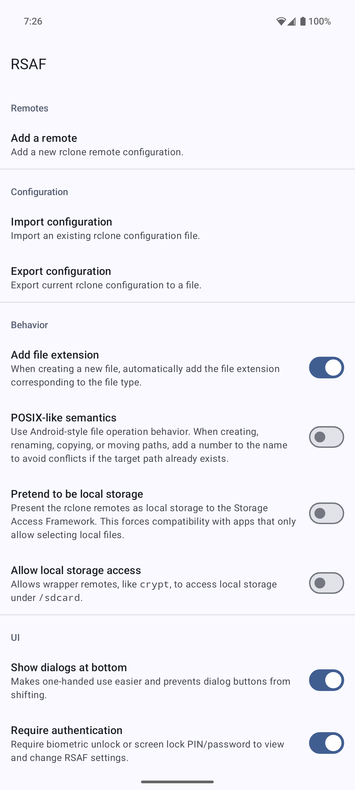
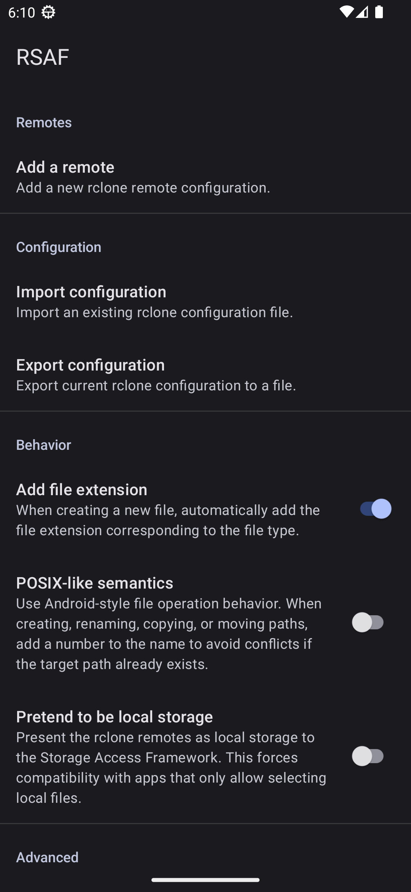

# RSAF


RSAF is an Android document provider for the wonderful [rclone](https://rclone.org/). It allows any app that supports Android's Storage Access Framework (SAF) to access remote files via rclone's backends.

RSAF is not itself a file manager, but any file manager supporting SAF, including the one built into Android (Settings -> Storage -> Documents), can make use of it.

 

## Features

* Supports Android 9 through 13
* Supports all rclone remote backends, including those that require OAuth 2.0
* Supports importing and exporting the rclone configuration file
* Supports random reads and writes
* Supports server-side copy/move for rclone backends implementing this feature
* Supports client applications that request access to a file descriptor
* Supports client applications that open entire directories with `ACTION_OPEN_DOCUMENT_TREE`
* Supports pretending to be local storage for apps that block remote SAF roots
* Supports both [Android-like and POSIX-like file operation semantics](#file-operation-semantics)
* [No permissions required besides network access](#permissions)

## Limitations

* The configuration interface is not translated.

    * In order to keep RSAF's code as simple as possible, the configuration system presents interactive questions just like the `rclone config` command. Due to this, the questions are always shown in English as rclone currently does not have internationalization support.

* Although RSAF always allows random writes, not all backends support it.

    * In this situation, files may be temporarily buffered to disk before they are uploaded. This is the same behavior as with `rclone mount --vfs-cache-mode writes`.

* Fancier file descriptor system calls are not supported.

    * Due to [Android API limitations](https://developer.android.com/reference/android/os/ProxyFileDescriptorCallback), only the normal `lseek()`/`read()`/`pread()`/`write()`/`pwrite()`/`fsync()` system calls are supported. Notably, `ftruncate()` is not supported.

    * Also, due to Android's internal implementation details with regards to FUSE, `close()` is asynchronous (and cannot be made synchronous). Files may not be fully uploaded yet when `close()` returns.

* Client applications may not be able to detect when errors occur.

    * Android's document provider API doesn't provide a way to properly report errors for certain operations, like listing a directory. Some apps may treat an error (`null` response) and an empty directory as the same.

* RSAF will crash if it is backed up and restored by root-based backup tools.

    * In order to keep credentials secure, the internal config file is encrypted with a password that's wrapped by a hardware key. Even with root access, it is impossible to back up hardware keys. Thus, when restoring RSAF's app data using these root-based backup tools, RSAF will not be able to decrypt its config file. Instead, use the builtin config import/export feature.

    * RSAF can optionally use Android's built-in backup feature: Google Drive on official Android builds or Seedvault on some custom Android OS's. If the `Allow Android backups` option is enabled, then Android will be able to back up RSAF's app data in these two scenarios:

        1. The backup mechanism is end-to-end encrypted
        2. The app data is being directly sent to a new device as part of the device setup, without it first being uploaded to the cloud

      This option is disabled by default because there's no way for RSAF to verify that these conditions are actually true. For example, some older OEM Android builds have backup systems that lie about end-to-end encryption. It is important for the backup mechanism itself to be secure because RSAF backs up its rclone configuration in plain-text.

## File operation semantics

RSAF supports operating with either Android-like (default) or POSIX-like semantics.

With Android-like semantics, when creating, renaming, copying, or moving a file/directory, RSAF will add a counter to the filename to try and avoid conflicts (eg. `file(1).txt`) if the target path already exists. This matches the Storage Access Framework's behavior for local files, though RSAF extends this to copying/moving instead of just file creation/renaming. However, this feature cannot be implemented in a completely foolproof way. If two client applications try to create files with the same name at the same time, they still might end up clobbering each other's data, even with the added counter.

With POSIX-like semantics, RSAF follows the behavior of the underlying filesystem calls. It'll behave more like common CLI utilities, such as `mv`, `cp`, or even `rclone` itself.

* Creating a new file/directory behaves like `touch`/`mkdir -p`. If the path already exists and is the same type, the operation will succeed.
* Renaming a file on top of an existing file will overwrite the existing file. Otherwise, if the target path alreacy exists, the operation will fail.
* Copying files/directories behaves like `cp -rT`. Files with the same name in the target will be overwritten. Directories will be merged (but conflicting files within directories are still overwritten).
* Moving paths behaves like copying paths, except that the source is gone once the operation succeeds.

## Usage

1. Download the latest version from the [releases page](https://github.com/chenxiaolong/RSAF/releases). To verify the digital signature, see the [verifying digital signatures](#verifying-digital-signatures) section.

2. Import an existing rclone configuration or configure one from scratch within RSAF.

3. That's it! The configured remotes are now available via the Storage Access Framework.

## Permissions

The only permission RSAF requires is the `INTERNET` permission. It is used only to allow rclone to access the configured remotes.

RSAF does not and will never have ads or telemetry.

## Verifying digital signatures

First, use `apksigner` to print the digests of the APK signing certificate:

```
apksigner verify --print-certs RSAF-<version>-<arch>-release.apk
```

Then, check that the SHA-256 digest of the APK signing certificate is:

```
b2506499bea1c5a6e658f07be6773fe486999dc124204c6522af7407503ac9f9
```

## Building from source

RSAF can be built like most other Android apps using Android Studio or the gradle command line. However, the golang compiler (`go`) and `gomobile` must both be installed first. They are needed for compiling rclone and rcbridge.

To build the APK:

```bash
./gradlew assembleDebug
```

The APK will be signed with the default autogenerated debug key.

To create a release build with a specific signing key, set up the following environment variables:

```bash
export RELEASE_KEYSTORE=/path/to/keystore.jks
export RELEASE_KEY_ALIAS=alias_name

read -r -s RELEASE_KEYSTORE_PASSPHRASE
read -r -s RELEASE_KEY_PASSPHRASE
export RELEASE_KEYSTORE_PASSPHRASE
export RELEASE_KEY_PASSPHRASE
```

and then build the release APK:

```bash
./gradlew assembleRelease
```

### Android Studio

When loading the project in Android Studio, it might be necessary to build rcbridge once first:

```bash
./gradlew rcbridge
```

Even though AGP (Android Gradle Plugin) is set up so that `rcbridge` is a `preBuild` dependency of all Android-related components, Android Studio seems to have trouble syncing the gradle project if rcbridge's `.aar` file doesn't exist yet. There is no issue when building on the command line.

## Dedication

RSAF is dedicated to my cat Meow-Meow, who unexpectedly passed away during the initial development of the project.


## Contributing

Bug fix and translation pull requests are welcome and much appreciated!

If you are interested in implementing a new feature and would like to see it included in RSAF, please open an issue to discuss it first. This is a side project that I work on for fun, so I'm hesitant to add features I won't personally use. I intend for RSAF to be as simple and low-maintenance as possible.

## License

RSAF itself is licensed under GPLv3. Please see [`LICENSE`](./LICENSE) for the full license text.

The bundled rclone is [licensed under MIT](https://rclone.org/licence/).
